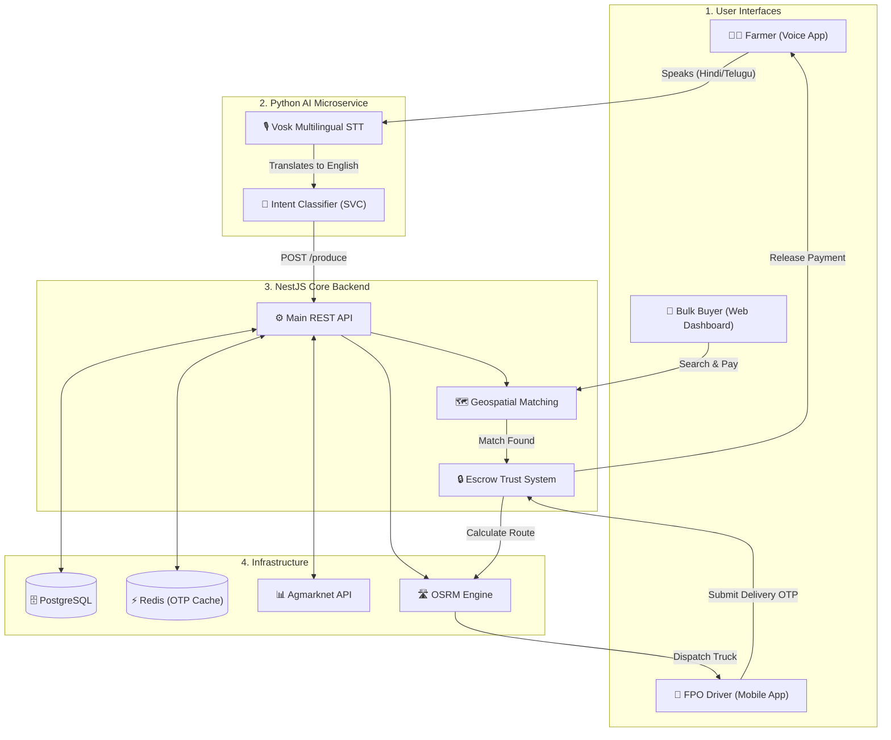

# 🎤 AgriConnect: Master Pitch Script & Workflow

*This document contains the step-by-step workflow of the platform and the exact script/flow you should use when pitching to the judges.*

---

## 🔄 1. The High-Level Architecture Workflow
*When explaining the architecture to the judges, point to your slides and walk them through this exact lifecycle of a single crop.*

1. **The Voice Input:** A farmer in rural Maharashtra presses a button and says, *"I want to sell 100 quintals of onions."*
2. **The AI Translation Bridge:** The Python Microservice dynamically loads the Marathi Vosk Model into RAM, transcribes the Marathi audio, translates it to English, and uses an SVC Intent Classifier to trigger the "Sell Produce" API.
3. **The Farm-Gate Listing:** The crops are officially listed on the marketplace. The database cross-references the official Agmarknet API and recommends the farmer price it at ₹22/kg based on a predicted demand surge.
4. **The Geospatial Match:** A bulk buyer in Mumbai searches for onions. The NestJS server runs a PostgreSQL Geospatial query to find our farmer because they are only 40km away. 
5. **The Escrow Lock:** The buyer pays a 20% advance. The money is securely locked in the AgriConnect Escrow system.
6. **The FPO Route Optimization:** The platform pings our custom OSRM engine to calculate the absolute fastest route avoiding traffic. An FPO truck is dispatched to the farmer's gate.
7. **The Final Payout:** The truck driver delivers the onions to Mumbai. The buyer provides a 6-digit Delivery OTP. Once entered, the backend triggers a Prisma `$transaction` block, instantly releasing the final 80% payout directly to the farmer's bank account.

---

## 🗣️ 2. The Pitch Script (How to Present)

### Phase 1: The Hook (0:00 - 0:30)
**Speaker:** *"Honorable Judges, the greatest tragedy of Indian agriculture isn't that farmers don't grow enough food. It is that they are trapped by middlemen, crippled by transport risks, and excluded from digital markets due to the literacy barrier.*

*Today, we are proud to present **AgriConnect**—not just another app, but a **Voice-First, AI-Driven Escrow Engine** that completely bypasses the digital divide."*

### Phase 2: The Problem with e-NAM (0:30 - 1:15)
**Speaker:** *"You might ask, why not just use the government's e-NAM app? Because e-NAM expects a rural farmer to read complex bidding charts on a smartphone. Furthermore, the farmer still has to pay to truck their crops to a physical Mandi. If the price is bad, they are trapped. They take 100% of the transport risk.*

*AgriConnect flips this paradigm. We use **Farm-Gate Matching**."*

### Phase 3: The AgriConnect Solution (1:15 - 2:30)
**Speaker:** *(Point to the Voice AI Demo)*
*"With AgriConnect, a farmer doesn't type. They speak in Hindi, Telugu, Marathi, or Gujarati. Our Multilingual Edge AI translates their voice intent in under 5 milliseconds and registers their crops while they are still in the field.*

*Next, we aggregate live Government data from Agmarknet. Our Python engine runs Time-Series Anomaly Detection to recommend the most profitable pricing directly to the farmer.*

*Finally, we connect them with city bulk buyers using Geospatial Routing. But how do we guarantee trust? We built a digital Escrow system. The buyer's money is locked in our backend. It is only released to the farmer when a secure 6-digit Delivery OTP is submitted at the final destination."*

### Phase 4: The Technical Flex (2:30 - 3:30)
**Speaker:** *(This is where you win the hackathon by showing you are real engineers, not just ideators).*
*"We didn't just build a UI wrapper; we built a highly scalable, production-ready backend infrastructure. 
1. We decoupled the architecture into two microservices (NestJS for high-throughput marketplace logic, and Python FastAPI for heavy ML processing).
2. To run 5 regional language AI models on a tiny 512MB RAM server, we engineered a **Dynamic Swapper** that loads acoustic models in and out of memory using Python Garbage Collection, preventing server crashes.
3. We completely bypassed expensive enterprise APIs like Google Maps. We self-hosted the Open Source Routing Machine (OSRM), achieving enterprise-grade logistics routing for $0 a month.
4. Finally, we implemented Redis In-Memory caching to rate-limit OTPs and cache government pricing, ensuring our platform loads instantly even on a rural 3G network."*

### Phase 5: The Conclusion (3:30 - 4:00)
**Speaker:** *"AgriConnect eliminates the middleman, eliminates transport risk, and guarantees zero-fraud payments, all through an interface as simple as speaking. We are ready for production. Thank you."*
